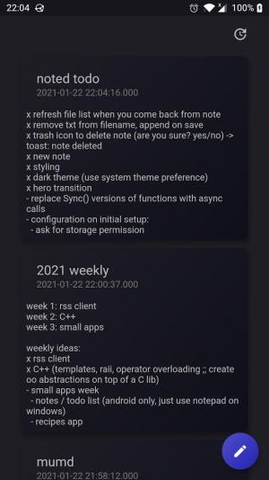

# Noted

Notes app made in flutter that works with real text files instead of some internal database.

This allows you to sync your notes across devices using a third party service.

Only works on android since iOS doesn't allow arbitrary read/writes of the file system.

---

As of right now some things are still janky/hard coded:

- Notes are stored in `/storage/emulated/0/Sync/Notes/`
- Storage access permission needs to be granted manually through the settings app
